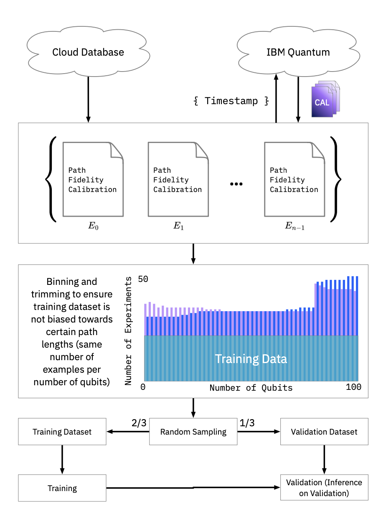
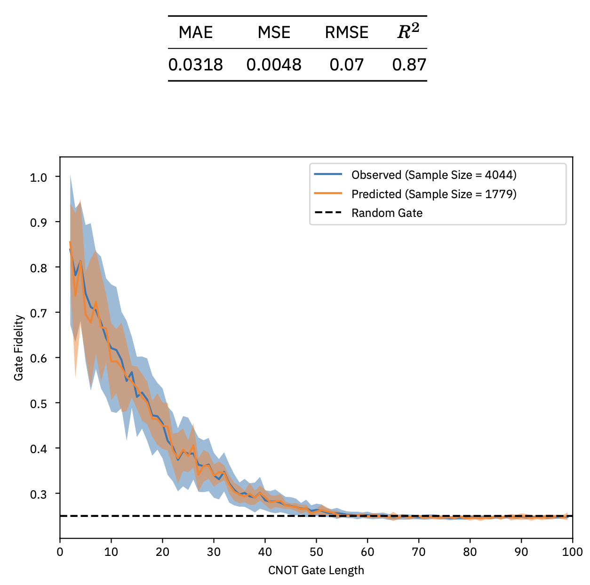

# XGSwap: eXtreme Gradient boosting Swap for Routing in NISQ Devices

Companion code for [https://arxiv.org/abs/2404.17982] submitted to QCE2024 [https://qce.quantum.ieee.org/2024/].

## Abstract

In the current landscape of noisy intermediate-scale quantum (NISQ) computing, the inherent noise presents significant challenges to achieving high-fidelity long-range entanglement. Furthermore, this challenge is amplified by the limited connectivity of current superconducting devices, necessitating state permutations to establish long-distance entanglement. Traditionally, graph methods are used to satisfy the coupling constraints of a given architecture by routing states along the shortest undirected path between qubits. In this work, we introduce a gradient-boosting machine learning model to predict the fidelity of alternative–potentially longer– routing paths to improve fidelity. This model was trained on 4050 random CNOT gates ranging in length from 2 to 100+ qubits. The experiments were all executed on ibm_quebec, a 127-qubit IBM Quantum System One. Through more than 200+ tests run on actual hardware, our model successfully identified higher fidelity paths in approximately 24% of cases.

## Repository Organization

This repository is composed of four distinct packages :

- `quantxg` holds the XGBoost model as well as weights to get you started with inference.
- `xg-swap` is a Qiskit transpiler plugin enabling the use of `quantxg` within the transpilation process of a `QuantumCircuit`.
- `demo` holds a preconfigured template you can use to get started easily
- `dataset` holds the training data exported from our database, which can be used to further optimize the model should you wish to do so.

## Quick Start

All our packages use `poetry` to manage python dependencies and create virtual environments. Install `poetry` using the guide at [https://python-poetry.org/docs/]. Once poetry is installed, navigate to `/demo` and run `poetry install`.
Finally, run the demo notebook to try XGSwap.

## Using the XGSwap Pass in Qiskit

### Introduction

In this guide, we will walk through how to use the `xg_swap` routing pass in Qiskit. Routing passes are crucial for adapting quantum circuits to the constraints of specific quantum hardware, ensuring that two-qubit gates are applied only between physically connected qubits.

### Prerequisites

Before we begin, ensure that you have installed Qiskit and the Qiskit IBM Provider. You can install these packages using pip if you haven't already:

```bash
pip install qiskit
pip install qiskit-ibm-provider
```

### Step 1: Import Necessary Modules

Start by importing the necessary modules from Qiskit.

```python
from qiskit import QuantumCircuit, transpile
from qiskit_ibm_provider import IBMProvider
```

### Step 2: Create a Quantum Circuit

Create a simple quantum circuit for demonstration. Here, we're using a circuit with 10 qubits where a controlled-X (CX) gate is applied between the first and the last qubit.

```python
circuit = QuantumCircuit(10)
circuit.cx(0, 9)
circuit.draw()
```

### Step 3: Set Up IBM Quantum Provider

Set up the IBM Quantum provider to access IBM's quantum systems. You'll need an IBM Quantum account for this step.

```python
provider = IBMProvider()
backend = provider.get_backend('ibm_quebec')  # Specify the backend
```

### Step 4: List Available Routing Methods

Before using `xg_swap`, it's useful to check what routing methods are available. You can list all available routing methods with the following command:

```python
from qiskit.transpiler.preset_passmanagers.plugin import passmanager_stage_plugins
passmanager_stage_plugins(stage='routing')
```

### Step 5: Transpile the Circuit Using xg_swap

Now, transpile your circuit using the `xg_swap` routing method. This method uses gradient boosting ML techniques to find an optimal path for routing gates in quantum circuits on devices with limited qubit connectivity.

```python
transpiled_circuit = transpile(
    circuits=circuit,
    backend=backend,
    routing_method="xg_swap",
    initial_layout=[q for q in range(10)]  # Define initial qubit layout
)
```

### Conclusion

You have now successfully used the `xg_swap` routing method in Qiskit to adapt a quantum circuit to the topology of IBM's Quebec backend. This method is especially useful for complex circuits on hardware with sparse qubit connectivity.

## Dataset Informations

This dataset contains results from 4,050 experiments conducted on the IBM Quebec quantum computer. Each experiment involves performing full process tomography of a CNOT gate executed along various paths on the device. The dataset records the time each experiment was created, the specific path of qubits used, the fidelity of the operation, and details about the backend, confirming that these are not simulated results.

### Key Metrics:

- **Count of Experiments**: There are 4,050 experiments documented.
- **Path Length**: The paths vary in length, with the average path involving approximately 53 qubits. The shortest path recorded has 2 qubits, and the longest stretches across 109 qubits.

### Sample Experiment

```json
{
	"time_created": "2023-12-13T17:08:52.179124+00:00",
	"path": [45, 46, 47, 48],
	"fidelity": 0.8675354057281781,
	"backend": {
		"name": "ibm_quebec",
		"is_simulator": false
	}
}
```

We apply the following method to the dataset to train the gradient boosting model:



### Training Results




# Acknowledgements

We would like to thank PINQ2 for the access to the machine ibm_quebec and the computation time needed for this study. My special thanks to Christophe Pere for his help and support @Christophe-pere [https://github.com/Christophe-pere].
